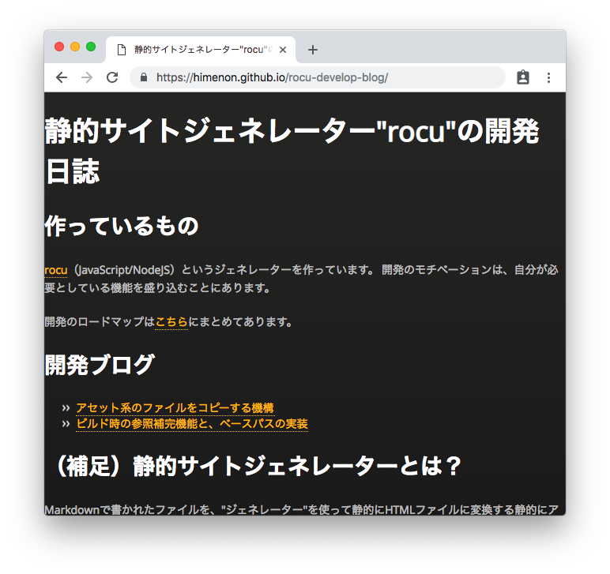
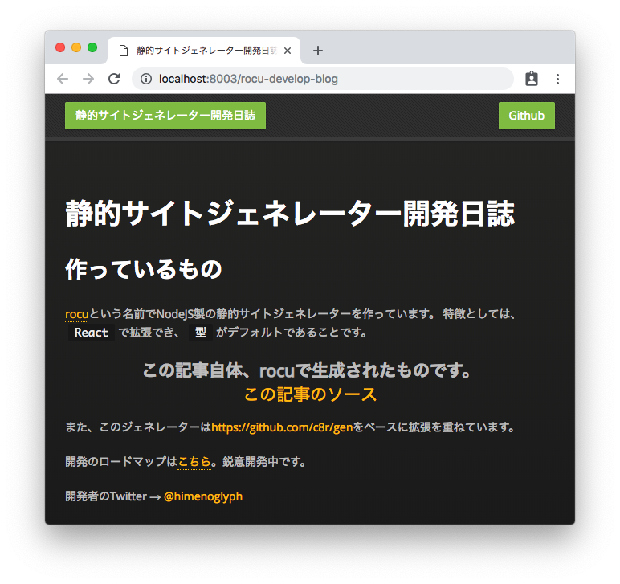
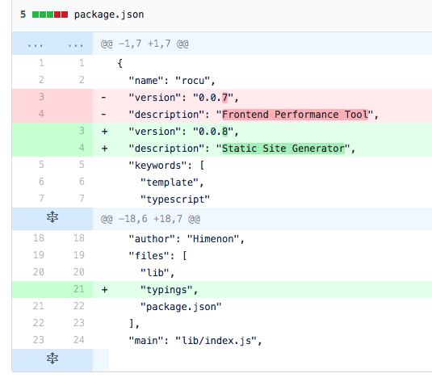
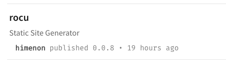
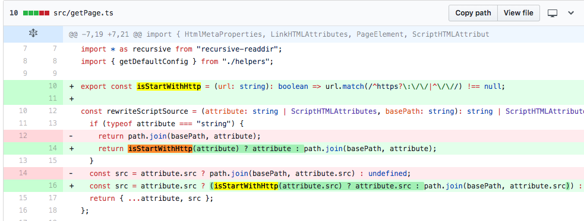

これまた[前回](./auto-link)最後に課題にしていたことを実装しました。

PR20に差分があります。

* https://github.com/Himenon/custom-site/pull/20

今回の新機能実装

1. body内のコンテンツに対してカスタムテンプレートを使えるように！
1. カスタムテンプレートがジェネレーターからいろいろなサイトやページの情報を含んだパラメーターを受け取ることができるように。型付きで！（重要）

カスタムテンプレートが使えるようになったので、このブログも見た目が大幅に更新！

* Before
  
* After
  

タイトルが変わったとか、書いている内容が変わったとか、そーいうのじゃないので。

## 実装の話

今回は使ってるAPIからなかなか面白かったです。ブレイクスルーした気持ちよさがあった実装回でした。

### カスタムテンプレート機能の実装

ググってみると出てくるもんです。

* <https://gist.github.com/KOBA789/752707>

8年前の投稿ですが、現在(v11.6.0)のAPIにも(多少変化はあったものの）ありました。

* https://nodejs.org/api/vm.html

実装自体はそんなに長くなくて、こんな感じです。

```ts
import * as fs from "fs";
import * as vm from "vm";

export const loadExternalFunction = <T>(filename: string): T | undefined => {
  // ここでexportsとrequireをsandboxに提供して置かなければ、内部でエラーになる
  const sandbox: vm.Context = vm.createContext({
    exports,
    require,
  });
  // 実行したいjsファイルの読み込み
  const data = fs.readFileSync(filename, { encoding: "utf-8" });

  if (typeof data !== "string") {
    return;
  }

  try {
    const script = new vm.Script(data, { displayErrors: true });
    script.runInNewContext(sandbox, { displayErrors: true });
  } catch (e) {
    console.error(`"${filename}" include below error.`);
    console.error(e);
  }
  // exportsされている定義を返す
  return sandbox.exports;
};
```

これで外部のjsファイルを読み込んで実行することが可能となりました。
ただ、バリデーションなどのチェック機構はなく、現状はI/Fを信じるのみです。

---

他に見つけたもの。

* https://github.com/patriksimek/vm2

TypeScript + Node + vm 的な検索をかけたけど、これしか引っかからなかった。
知らないけど多ラッパーなので、直に生えているAPIを優先して使うことにしました。

### PagePropsの作成

カスタムテンプレートを使うとなると、サイト自体の周辺情報が欲しくなるんですよね。
サイトタイトルだとか、記事のタイトルだとか、投稿日だとか、ナビゲーションだとか....

カスタムテンプレートに渡すのは割と簡単だけど、何を渡すのか決めるのが結構たいへん。
なので、他のジェネレーターを参考に今後は作っていくと思う。v1.0.0ににあるのは遠いなー（棒）

* https://jekyllrb.com/docs
* https://middlemanapp.com
* https://www.gatsbyjs.org
* https://vuepress.vuejs.org
* http://docs.getpelican.com
* https://www.mkdocs.org
* https://gohugo.io

洗い出しからやなぁ...

### Bug fix

package.jsonの修正の修正をしました。型定義ファイルがexportされていなかったので、PagePropsの型がimportできないことから発覚。



また、descriptionも修正しました。npmの簡易説明のところで別の文言になっていたので調整。



あとは、`meta`タグ内のURLが`http`から始まる場合でもベースパスをつけるようになっていたので修正。
`//`で始まっている場合にも対応しました。




バグを潰した？まだまだ。やつらは四天王の中でも最弱。他にもいっぱいあるぜ。

Triple Slashで型定義ファイルをimportしないといけないやつとか辛い。

## 次やること

PagePropsの仕様策定とかあるんですけど、それはまだ小さいことで、大きなことがまだあるんですよね。

* カスタムコンポーネントのサポート
* Google Analyticsのデフォルトサポート
* 作成日・更新日をファイルの変更履歴から取得する
* プラグイン機構の整備
* パフォーマンス計測
* MDXコンポーネント内のテキストのMarkdown to HTML
* CSS系どうするの？
* Quick Startどうするの？

とかーーーーーー！！！！([ロードマップ](../loadmap)に書いてます)

多分、上2つを片付けようかなと思います。

## 関連記事

* [次の記事: カスタムコンポーネント機能の実装](./custom-component-system)
* [前の記事: ビルド時の参照補完機能とベースパスの実装](./auto-link)
