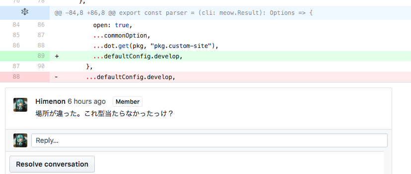

PR 26

* https://github.com/custom-site/custom-site/pull/26

今回の新機能

1. Google Analyticsの設定がconfig.jsonから出来るように


`config.json`に`thirdParty`を掘りました。
その中にGoogle Analyticsの設定値を記述されたら`script`タグが
`</head>`の直前にささる算段です。

```json
{
  "global": {
    "thirdParty": {
      "googleAnalytics": {
        "ua": "UA-xxxxxxx-x" // ココ！
      }
    }
  }
}
```

参考

* https://developers.google.com/analytics/devguides/collection/analyticsjs
* https://support.google.com/analytics/answer/1008080

## 実装の話

### Google Analytics用のタグを作る

何のひねりもありません。実装は次の通りです。

```tsx
import { ThirdParty } from "@custom-site/page";
import * as React from "react";

const code = (ua: string) => `
(function(i,s,o,g,r,a,m){i['GoogleAnalyticsObject']=r;i[r]=i[r]||function(){
(i[r].q=i[r].q||[]).push(arguments)},i[r].l=1*new Date();a=s.createElement(o),
m=s.getElementsByTagName(o)[0];a.async=1;a.src=g;m.parentNode.insertBefore(a,m)
})(window,document,'script','https://www.google-analytics.com/analytics.js','ga');

ga('create', '${ua}', 'auto');
ga('send', 'pageview');
`;

export const generateGoogleAnalyticsElement = (params: ThirdParty["googleAnalytics"]) => {
  if (!params || !params.ua) {
    return;
  }
  const props: JSX.IntrinsicElements["script"] = {
    dangerouslySetInnerHTML: {
      __html: code(params.ua),
    },
  };
  return <script {...props} />;
};
```

これを`</head>`の直前に挿して、パラメータを渡せば完了です。

あとは、外部から与えられるような値（今回だと`config.json`）は基本信頼しない値として扱うことで、
不本意な値の混入を防ぎましょう。

```ts
export interface ThirdParty {
  googleAnalytics?: { // 無いものとして扱う
    ua?: string;      // 無いものとして扱う
  };
}
```

これをやっておかないと、すぐに`undefined`が混入したり、途中で落ちたりするので注意ですね。

### Bug fix

次のものを修正しました。

* `config.json`の設定値がdevのときに反映されない問題の解決



すみません。展開する場所を間違っていました。

## 次やること

前回、いろいろと名前を決めていったので、もろもろ移動していきます（またか）。
`@custom-site`という名前空間がGithub/NPM Registryともに空いていたので移植する話です。

## 関連記事

* [次の記事: リポジトリ・パッケージ管理をOrganizationに移譲しました](./transfer-manage-repository-to-organization)
* [前の記事: パッケージ名を変更しました](./change-package-name-to-custom-site)
