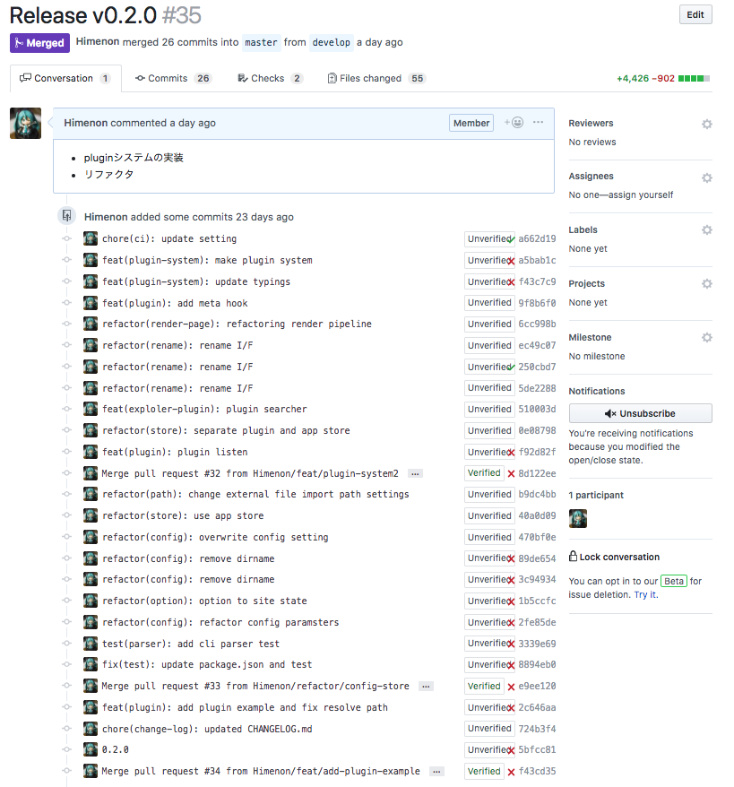

前回からだいぶ時間が空いてしまった。
何もやっていなかったわけではなくて、プラグインの機構をどう作るか考えていました。

さて、今回のお品書きですが、下記のPRになります。

* https://github.com/custom-site/custom-site/pull/35



ほぼリファクタです！！！！！！そして一部デグレッたことが記事を書いているときにわかりました（ビルドには問題はない）。

## 今回の新機能と改修

* プラグインのための機構を作ったよ
* 一部インターフェースが変わったよ（重要）

### プラグインのための機構を作るモチベーション

今回、"プラグイン"を導入するためだけに修正量をみるだけでも相当な変更を入れました。
まずはそのモチベーションを箇条書きで書き出して置きます。

1. `meta`タグのプロパティをoverrideしたかった
1. いつか実装しないといけないなぁと思っていたが、上記の理由で必要になった
1. EventEmitter形式の型定義を書くノウハウが蓄積していた
1. Gatsbyのプラグイン実装を見るとEventEmitterだった

2,3,4は1のついででしかなかったｗ
とにかくやりたかったのは、Twitterにサイトのリンクを貼ったときに`og:title`とかが反映されること。
これを実現するためには、**ページごとに**のタイトルをmetaタグに記入する必要がありました。

やろうと思えばできなくもなくって、

```yaml
---
title: ページタイトル
og:title: ページタイトル
---
```

という感じで拡張できなくもないのですが、2度書くのはDRYの精神に反するので却下だし、これまで書いてきた記事に対しても同じ作業をやるのは苦痛以外の何物でもない。

このような~~邪念~~理由でプラグイン機構を導入しようと決断したのです。

まぁ、他にもいろいろとメリットはあるのですが、こうやって記事を書いている以上はSEO部分もちゃんとサポートしておくべきでしょう、
ということで優先度を上げて対応をしました。

これらが今回のモチベーションです。（まとまってないけど、まとめる気もない）

### どうやって実装したか

さっき書いてしまいましたが、[EventEmitter](https://nodejs.org/api/events.html)形式で構築しました。

Gatsbyのコードを見てみると、[mitt](https://github.com/developit/mitt)というEventEmitterライブラリを用いてプラグイン機構を実装しています。

* https://github.com/gatsbyjs/gatsby/search?q=emitter.on&unscoped_q=emitter.on
* https://github.com/gatsbyjs/gatsby/search?q=emitter.emit&unscoped_q=emitter.emit

`custom-site`ではどうやってこれを導入するか、を考えたときに問題が生じました。
それは、アプリケーション内のStateをどう管理するか、というところです。
プラグインによって改変されても良いStateと、されてはいけないStateが存在しています。
これらを別々にStore管理することで責務を分離して行くことで保守性を上げていくようにしました。

* アプリケーション管轄のState
  * configファイルやcliから読み取った設定値
  * プラグインの情報（プラグイン名やその場所のパス）
* プラグイン管轄のState
  * metaタグに利用する元データ
  * etc....

#### Storeの実装

StoreはStateを管理するためのものです。functionベースでもclassベースでも実装できますが、今回はclassベースで実装しました。
（Storeの階層構造を保つ場合はclassの方が取り扱いやすいだろうと思い）

実際のコードは次の通り

```ts
interface State {
  [id: string]: any;
}

export class Store<U extends {}> {
  private state: State = {};
  public set<T extends keyof U>(params: { type: T; id: string; state: U[T] }): void {
    this.state[`${params.type}/${params.id}`] = params.state;
  }
  public get<T extends keyof U, S>(params: { type: T; id: string }, defaultState?: S): S extends U[T] ? U[T] : (U[T] | undefined) {
    return this.state[`${params.type}/${params.id}`] || defaultState;
  }
}
```

Storeは拡張できるようにGenricsを使っていろいろと仕込みました。
プラグインのStateは次のようになっていて、これをGeneritcsにぶちこんでやれば`set`/`get`の`type`、`state`が同時にきまる。
idはどうしても同一のStateを扱いたいが、同じ（内部Stateの）キー名で保存したくない場合に利用する。
（ここは本当はデフォルト値などを指定して、必要なときにだけ明示的に指定するような形にしたい）

```ts
export interface State {
  GENERATE_META_DATA: { metaData: HtmlMetaData };
}
```

また、`get`時は第2引数に`defaultState`を用意した。これは地味に便利で、取り出し時に`undefined`にならないようにするために作った。

プラグインのStoreの場合はこれが特に有効で、次のように記述できる。

```ts
const newState = pluginStore.get({ type: "GENERATE_META_DATA", id: "" }, oldState); // State
```

プラグインはその特質上、「あってもなくてもいい存在」なので、改変の対象となるStateはプラグインの前後に必ずいるはずである。
そのコンテキストがあるにもかかわらず、初期値を指定できないでいると、次のようなパターンを量産することになる。

```ts
let newState = pluginStore.get({ type: "GENERATE_META_DATA", id: "" }); // State | undefined
if (!newState) {
  newState = oldState
}
```

Swiftのようなifの条件文に代入ができるような書き方ができたら良かったのになぁ、とこの度に思う。
（`instanceof`を使った書き方っぽい事はできるけど、そういうパターンでは今回はないので）

* 参考：[Swift is like TypeScript](https://alhazmy13.github.io/swift-is-like-typescript/)

#### プラグイン用のEventEmitterの実装

[mitt](https://github.com/developit/mitt)の実装を拡張して書き直しました。
特徴は、プラグイン用のStoreを注入して、emit時に内部改変を許容しことです。

```ts
const createPluginEventEmitter = (store: PluginStore) => {
  const handlers: EventHandlerMap = {};
  return {
    on<K extends keyof EventHandlerMap>(event: K, handler?: CreateHandler<K>): void {
      if (handler) {
        ((handlers[event] || (handlers[event] = [])) as Array<CreateHandler<K>>).push(handler);
      }
    },
    emit<K extends keyof EventHandlerMap>(event: K, state: State[K] & { id: string }): void {
      let newState: State[K] = store.get({ type: event, id: state.id }, state);
      ((handlers[event] || (handlers[event] = [])) as Array<CreateHandler<K>>).forEach(handler => {
        // Stateのoverrideを許容する
        newState = handler(newState);
      });
      store.set({ type: event, id: state.id, state: newState });
    },
  };
};
```

初期化時にStoreを渡しておくことで、それ移行は通常のEventEmitterと同じように利用することができます。
プラグインによって改変されたStateを取り出すときは、プラグイン管轄のStoreからgetすれば良いだけになります。

今回だと、metaタグの書き換え箇所が例となります。

```ts
const createHead = (page: PageState) => {
  const id = `GENERATE_META_DATA/${page.uri}`;
  const state = { metaData: page.metaData, id };
  pluginEventEmitter.emit("GENERATE_META_DATA", state);
  const metaData = plugin.get({ type: "GENERATE_META_DATA", id }, state).metaData;
  return createHeadContent(metaData);
};
```

プラグイン自体はなくても良いものなので、もしこのプラグイン機構自体が不要になった場合は

```ts
const createHead = (page: PageState) => {
  return createHeadContent(page.metaData);
```

とするだけ良いでしょう（あくまでも上記は例）。
プラグインを導入する箇所の前後には、改変対象のstateが必ずいるので、
デフォルト値を利用する価値がここにあることがわかると思います。

#### プラグインの探索

プラグインは外部からimportしてくるので探索して上げる必要があります。
Nodeの場合は`npm i`でパッケージをインストールして、パッケージ名をプラグインの設定箇所に書くだけ、というのが
利用者にとって体験は良いでしょう。

また、ちょこっとしたプラグインを開発したいときに相対パスで自前で書けるのも嬉しいと思います。

`node_modules`以下のパッケージを探索する場合に参考になるライブラリは

* https://github.com/sindresorhus/resolve-pkg
* https://github.com/sindresorhus/resolve-from

があります。`require("module")._resolveFilename`を探索を任せていて、
見ていてアハ体験しました。

自分で書かなくていいのはとても良いことです...ただ、型定義ファイルは`_resolveFilename`が書かれていないので、
型を潰しての利用になってしまいますが。

#### おわる

書き出すとキリがなくて、あれもこれもとなってしまうので"実装を見て！"が本当のところ。
あとは記事を書くのはいいんだけど、使い方のドキュメントをはよかけよ、というのが心の中から聞こえているので、
そちらもぼちぼち書きたいなという気持ちです。

読んだ資料とかリンクは残しておくので、自分で作るときの参考にしてくださいな。
（WEBフレームワークのミドルウェアや、プラグインの実装も結構有用なので好きなやつ読んだほうが理解がはかどります）

## 参考資料

いろいろなライブラリのプラグイン機構に目を通すと実装の幅が広がります。

* https://www.gatsbyjs.org/docs/plugins/
* https://jekyllrb.com/docs/plugins/
* https://www.mkdocs.org/user-guide/plugins/
* https://vuepress.vuejs.org/plugin/
* https://webpack.js.org/concepts/plugins/
* https://rollupjs.org/guide/en#plugins
* https://nuxtjs.org/guide/plugins
* https://github.com/Microsoft/typescript-tslint-plugin

### 実装とか

* [nuxt\.js/builder\.js](https://github.com/nuxt/nuxt.js/blob/36ca945d004acf049b8110ca196448b03e7ca7a8/packages/builder/src/builder.js#L135-L163)
* [mkdocs/plugins\.py](https://github.com/mkdocs/mkdocs/blob/f4d0b52e8cb86b84708a941b230a5029f4a5d657/mkdocs/plugins.py#L27-L32)

#### その他いろいろな記事

* [setuptoolsを使ったpluginサンプル egg編 — 清水川Web](http://www.freia.jp/taka/docs/pyhack4/setuptools/setuptools-plugin2.html)
* [Python: setuptools のプラグイン機構 pkg\_resources を使ってみる \| CUBE SUGAR STORAGE](http://momijiame.tumblr.com/post/82484166907/python-setuptools-%E3%81%AE%E3%83%97%E3%83%A9%E3%82%B0%E3%82%A4%E3%83%B3%E6%A9%9F%E6%A7%8B-pkgresources-%E3%82%92%E4%BD%BF%E3%81%A3%E3%81%A6%E3%81%BF%E3%82%8B)
* [Gatsby Node APIs](https://www.gatsbyjs.org/docs/node-apis/)
* [Gatsbyはどうやって静的サイトをジェネレートしているのか – Eureka Engineering – Medium](https://medium.com/eureka-engineering/how-gatsby-works-bec4349caa12)
* [azu/JavaScript\-Plugin\-Architecture: JavaScriptプラグインアーキテクチャの本](https://github.com/azu/JavaScript-Plugin-Architecture)
* [gatsby/packages/gatsby/src/internal\-plugins at master · gatsbyjs/gatsby](https://github.com/gatsbyjs/gatsby/tree/master/packages/gatsby/src/internal-plugins)
* [Using Express middleware](http://expressjs.com/en/guide/using-middleware.html)
