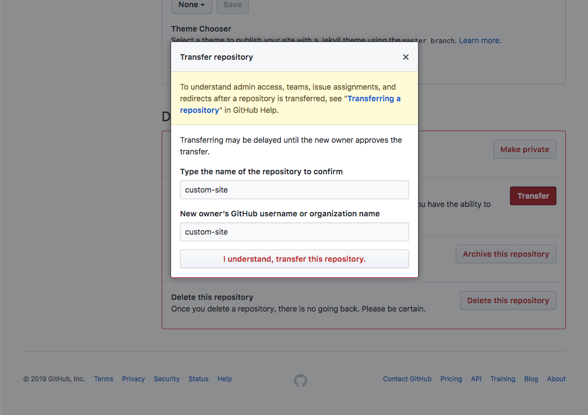
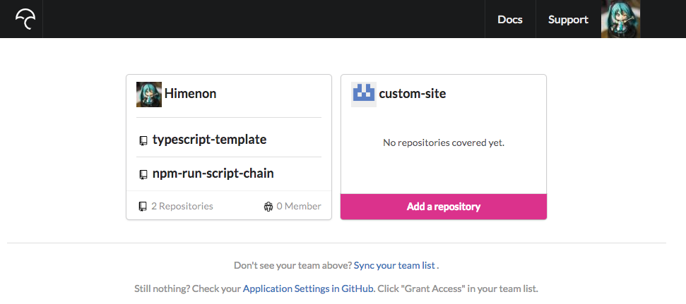
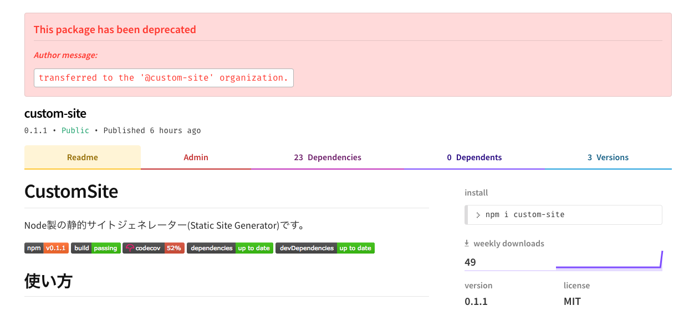
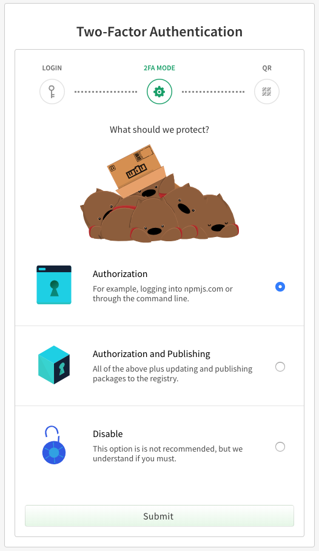
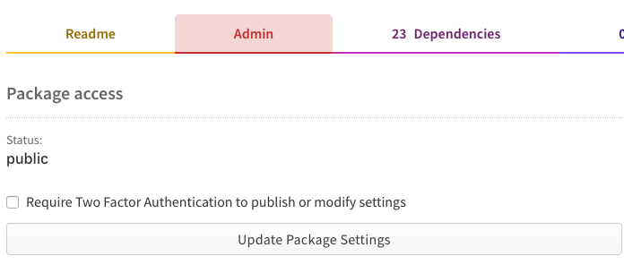

今回の話

* CIを`travis-ci.org`から`travis-ci.com`に引っ越した
* リポジトリを`https://github.com/Himenon/custom-site`から`https://github.com/custom-site/custom-site`に引っ越した
* CodeCovをPersonalからTeamに変更した
* NPMレジストリをPersonalからOrganizationに引っ越した
* `npm publish`の2FAにハマった

全体的に"[GitHubで個人リポジトリからOrganizationリポジトリにしてやったこと一覧](https://qiita.com/yu1ro/items/5da82882647b4c400559)"の記事の焼き直し。

## お話

### GithubのリポジトリをPersonalからOrganizationに引っ越し

リポジトリの`Settings`のDangaer Zoneの中にありました。

今回の行き先は`custom-site/custom-site`なので、同じ文字列が入りました。



CI系の設定も引き継がれるようですが、Personalのときのままなので再設定したほうが良いでしょう。

### CodeCovをPersonalからTeamに変更した

移植前の設定をすべてRevokeして、設定してきます。
CodeCovでは`Team`という単位でOrganizationのリポジトリを扱っていくようです。

面倒くさいので、Github Marketplace(https://github.com/marketplace/codecov)からcodecovの設定を行いました。

これをやった上で https://codecov.io/gh に行くとリポジトリが見えるようになっていると思います。
（いろいろやってみたけどこれが一番早かった）



### CIをtravis-ci.orgからtravis-ci.comへ引っ越した

* https://docs.travis-ci.com/user/legacy-services-to-github-apps-migration-guide/
* [Travis CIは公開リポジトリもプライベートリポジトリもtravis-ci.comになるみたい](https://qiita.com/nwtgck/items/da0e2f5ba2247403c2db)

orgからcomへとりあえず引っ越しておけば良し。

どうやら、ボタンでポチッと出来る機構は現在(2019/01/06)は無いので、env系が全部吹っ飛びます。
まぁ、そんなに多くない（~~浅はか~~）ので全部revokeして、comの方で再度設定していきました。

Github側のAPIも切っていくことをお忘れなく。

### パッケージ名の変更

`@custom-site`という名前空間を押さえているのでpackage.jsonとかをrenameしていきます。  
あえてコマンドで打つなら

```
npm init --scope=@custom-site
```

でおｋ。勝手にやってくれた。あとは内部の使っている箇所を変更していくだけでした。

参考

* https://efcl.info/2015/04/30/npm-namespace/

### パッケージをdepcrecateにする

https://www.npmjs.com/package/custom-site をdeprecateにします。
ローカルからcliを叩けば完了。

```
npm deprecate custom-site "transferred to the '@custom-site' organization."
```



unpublishはしばらくしてからやろうと思います。パッケージの名前空間自体を削除する場合はサポートにメールだったかな？
あとは

"[npmで使われてないアカウントを解放してもらった](https://efcl.info/2018/05/07/dispute-npm-account/)"にあるように他人がほしいって言われたときに渡すとかですかね。

### npm publishの2FAにハマった

|ユーザー側の設定|パッケージ側の設定|
|:------------|:--------------|
|||

両方に2FA入れてがんじがらめにやってもいいけど、CIがautomationできなくなるよ！ということを伝えたい。s

回避策としては、

* ユーザー側の2FAは`Authorization`のみにする（publishはauthTokenで出来るように）
* パッケージ側の設定はなし（※決して推奨しているわけではない）

これが、CIで自動でやるトレードオフ。

<blockquote className="twitter-tweet" data={{ lang: "ja" }}><p lang="ja" dir="ltr">なるほどー<a href="https://t.co/Ot5BnfXtVH">https://t.co/Ot5BnfXtVH</a></p>&mdash; HimeNyan (@himenoglyph) <a href="https://twitter.com/himenoglyph/status/1081633834146250752?ref_src=twsrc%5Etfw">2019年1月5日</a></blockquote>
<script async src="https://platform.twitter.com/widgets.js" charSet="utf-8"></script>

<blockquote className="twitter-tweet" data={{ lang: "ja" }}><p lang="ja" dir="ltr">ユーザーとパッケージのそれぞれに2FAの設定が可能で、パッケージ側から2FA要求をした場合、publishのときも引っかかるようになる。ログインだけじゃなく。ユーザーの2FAはpublishの設定を引いた設定があるので、それを利用すれば少なくともユーザーログインが2FAで縛れる</p>&mdash; HimeNyan (@himenoglyph) <a href="https://twitter.com/himenoglyph/status/1081635545455841280?ref_src=twsrc%5Etfw">2019年1月5日</a></blockquote>
<script async src="https://platform.twitter.com/widgets.js" charSet="utf-8"></script>

## 次やること

名前空間で区切ることに成功したので、lernaあたりを使って開発出来るようになった。
が、まだいろいろと実装を入れていきたいのでしばらく混沌とした今の状態が続くと思う。

次やるのは

* ファイルから生成日・更新日を取得反映
* Reactでバインドしたイベントが動かせるか試す

ですかね。

## 関連記事

* [次の記事: プラグイン機構を作りました](./make-plugin-system)
* [前の記事: Google Analyticsがconfigから利用できるようになりました](./google-analytics)
